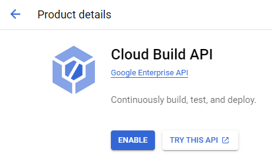

# Appendix

## A-1: Go Deploy to GCP

本セクションでは、Golang で作った API を Google App Engine (GAE) にデプロイするためのミニマムのステップ例を紹介する。
なお、本編はすべてオンプレ上で構築することを前提としており、GCP 上にデプロイすることは一切考慮していない。必要なら自力で解決されたし。

### A-1-1: Google Cloud SDK のインストール

`gsutil` や `gcloud` コマンドがすでに使えるのであれば、このセクションはスキップする。

はじめに、GCP のサービスを CLI から利用するための SDK ツールをインストールする。
インストール手順は公式ドキュメントの案内に従う。
https://cloud.google.com/sdk/docs/install

まず、ドキュメントの案内通り、Python 3.5 ～ 3.9 がインストールされた環境を用意する。
これは、SDK が Python コマンドを使って動くためである。

ここでは、あくまで一時的かつ限定的な利用のため、Docker で環境を用意することにする。
継続的に利用予定があるのなら、コンテナ外にインストールすることを推奨する。

> **Note**
> コンテナで用意すると、docker service を再起動するたびに都度インストールを行う必要がある。

```dockerfile:Dockerfile
FROM golang:1.16

RUN apt update && apt -y upgrade
```

```yaml:docker-compose.yml
version: '3'
services:
  golang:
    build: .
    container_name: 'golang'
    tty: true
    environment:
      TZ: Asia/Tokyo
    volumes:
      - ".:/go/src/app"
    working_dir: /go/src/app
```

環境が用意で来たら、SDK をインストールする。
ここでは、Linux 環境を想定した手順を示す。
インストール中に表示される質問には、基本的に `Y` (Yes) と答えておけばよい。

```bash
# Docker で環境を用意したならコンテナ内に入っておく
$ cd appendix
$ docker-compose up -d
$ docker-compose exec sandbox bash
# 実際のインストール作業はここから
$ curl -O https://dl.google.com/dl/cloudsdk/channels/rapid/downloads/google-cloud-cli-410.0.0-linux-x86_64.tar.gz
$ tar -xf google-cloud-cli-410.0.0-linux-x86_64.tar.gz
$ ./google-cloud-sdk/install.sh
略
$ ./google-cloud-sdk/bin/gcloud init
Welcome! This command will take you through the configuration of gcloud.

Your current configuration has been set to: [default]

中略

You must log in to continue. Would you like to log in (Y/n)?  Y

Go to the following link in your browser:
    # ここに表示されている URL にアクセスして、使いたい GCP プロジェクトに紐づいた Google アカウントにログインする
    https://accounts.google.com/o/oauth2/auth?...
# ログイン後に表示された認証コードをコピーしてここに貼る
Enter authorization code: ***

中略

You are logged in as: [hogehoge@gmail.com].

# ログインしたアカウントに紐づいたプロジェクト一覧が表示されるので、使いたいプロジェクト番号を指定する
Pick cloud project to use:
  [1] hogehoge
Please enter numeric choice or text value (must exactly match list item):  1

Your current project has been set to: [hogehoge].

中略

* Commands that require authentication will use hogehoge@gmail.com by default
* Commands will reference project `hogehoge` by default
Run `gcloud help config` to learn how to change individual settings

中略

$ source /root/.bashrc
```

これで `gsutil` や `gcloud` コマンドが使えるようになる。

### A-1-2: Go のプログラムをデプロイする

`gcloud` コマンドが使えるようになったら、メインディッシュのデプロイを行う。
今回は Google が提供しているサンプルプログラムがあるので、これを使用する。
https://github.com/GoogleCloudPlatform/golang-samples

> **Note**
> 最低限、ランタイムバージョンを指定する `app.yaml` と `package main` が定義された `.go` ファイル(サンプルだと `hellowordl.go` )があればよさそう。

なお、2023/1/7 現在、スタンダード環境では以下のバージョンが実行できる。

> あらゆるフレームワーク、ライブラリ、バイナリを実行できる Go 1.12 と Go 1.11 のランタイム。
> https://cloud.google.com/appengine/docs/go?hl=ja
> Go 1.12 以降のランタイムは、Go 1.12、Go 1.13、Go 1.14、Go 1.15、Go 1.16、Go 1.18（プレビュー）、Go 1.19（プレビュー）の主要バージョンをサポートしています。アプリは、app.yaml ファイルで指定されているバージョンの最新の安定版を使用します。App Engine では、新しいパッチ パージョンに自動で更新されますが、メジャー バージョンの更新は自動的には行われません。
> https://cloud.google.com/appengine/docs/standard/go/runtime?hl=ja

サンプルでは 1.15 を利用している。

```yaml:app.yaml
runtime: go115
```

何はともあれ、デプロイをしてみよう。

```bash
$ git clone https://github.com/GoogleCloudPlatform/golang-samples.git
$ cd golang-samples/appengine/go11x/helloworld/
$ ls
app.yaml  go.mod  go.sum  helloworld.go  helloworld_test.go
# これがデプロイコマンド
$ gcloud app deploy
Services to deploy:

descriptor:                  [/opt/projects/golang-samples/appengine/go11x/helloworld/app.yaml]
source:                      [/opt/projects/golang-samples/appengine/go11x/helloworld]
target project:              [hogehoge]
target service:              [default]
target version:              [20230107t185209]
target url:                  [https://hogehoge.df.r.appspot.com]
target service account:      [App Engine default service account]


Do you want to continue (Y/n)?  Y

Beginning deployment of service [default]...
╔════════════════════════════════════════════════════════════╗
╠═ Uploading 0 files to Google Cloud Storage                ═╣
╚════════════════════════════════════════════════════════════╝
File upload done.
Updating service [default]...done.
Setting traffic split for service [default]...done.
Deployed service [default] to [https://hogehoge.df.r.appspot.com]

You can stream logs from the command line by running:
  $ gcloud app logs tail -s default

To view your application in the web browser run:
  $ gcloud app browse
# ブラウザからアプリにアクセスする
$ gcloud app browse
Did not detect your browser. Go to this link to view your app:
https://hogehoge.df.r.appspot.com
# アプリのログを見たいとき
$ gcloud app logs tail -s default
```

これで表示された URL、ここでは、
https://hogehoge.df.r.appspot.com
にアクセスすれば、立ち上げたアプリを叩くことができる。


ちなみにデプロイには Cloud Build API が必要になる。
もし無効状態になっている場合は、デプロイに失敗し、API を有効化せよというエラーメッセージが出る。
エラーメッセージの案内に従って Cloud Build API を有効化する。
https://console.cloud.google.com/apis/library/cloudbuild.googleapis.com



> **Note**
> Cloud Build API の有効化にはプロジェクトと請求先アカウントの紐づけが必要になる。
> デプロイ対象のプロジェクトに紐づいていない場合は有効化前に紐づけをするように案内が出る。
> 案内に従って請求先アカウントの紐づけを行った後、再度 API の有効化を試すと正常に有効化できる。
> https://cloud.google.com/billing/docs/how-to/manage-billing-account?hl=ja

#### その他参考文献

- [go で Web サービス No\.4\(GAE にデプロイ\)](https://zenn.dev/tomi/articles/2020-10-07-go-web4)

### A-1-3: アクセス制限をつける

デプロイは成功したが、このままだと API は全世界にオープンな野ざらし状態になっている。
個人的な実験用途であればよいかもしれないが、ビジネスシーンなどでは社内の限られたメンバーのみアクセスできるよう制限を設けたいだろう。
そこで、Cloud Identity Aware Proxy (Cloud IAP)を使ってアクセス制限を掛けることにする。

Cloud IAP とは、ウェブサイトへのリクエストの中間に入って、リクエストを送信したユーザーの認証を行い、認証されたユーザーにのみサイトへのアクセスを許可する、という一連の処理を行う GCP サービスの 1 つである。

#### IAP を設定

サービスの「Identity-Aware Proxy」に移動する。
https://console.cloud.google.com/security/iap/getStarted

無効になっている場合は、画面の案内に従って、API を有効にする。


有効化できたら、「同意画面を構成」をクリック。


必要事項を適当に入力する。
このあたりの設定は以下の記事が参考になる。

- [IAP で保護されたリソースの認証をスクリプトで突破する](https://zenn.dev/sugasuga/articles/c8be86a1d6ac71)
- [Cloud IAP\(Identity\-Aware Proxy\)で GAE に ID 認証をかける \| ヤマログ](https://yamavlog.com/traial-gcp-cloud-iap/?amp=1)

> **Note**
> User Type は GCP で組織を導入していない限り「外部」しか選べない。

設定出来たら対象アプリの IAP のトグルを押して有効化する。


有効化後にブラウザからアプリケーションにアクセスしようとするとログイン画面が表示される。
仮にログインしたとしても、後述する IAP-secured Web App User に登録していないので無事弾かれる。
curl などでアクセスしようとしても、失敗して空文字が返ってくる。
これで野ざらし状態でなくなった。


#### IAP 許可ユーザーにサービスアカウントを追加

続いて、プログラムからアプリにアクセスできるようにする。

まずは、アプリにアクセスする際に使用するサービスアカウントキーを作成する。
「IAM と管理」から「サービスアカウント」に移動する。


使用するサービスアカウントをクリックする。
ここでは、サービスアカウントは名前が `AppEngine default service account` (AppEngine を作った際に自動で作成されたもの)を使うことにする。


> **Note**
> 場面に応じて適切なサービスアカウントの作成を行うこと。

「新しい鍵を作成」を選択する。


キーのタイプは JSON を選択する。

キーを新規作成すると credential 情報が書かれた json ファイル(おそらく `serviceaccount名-ハッシュ値.json` というファイル名)がダウンロードされるので、これを環境変数に登録する。

```bash
$ export GOOGLE_APPLICATION_CREDENTIALS=hogehoge.json
```

プログラムから `GOOGLE_APPLICATION_CREDENTIALS` を使って認証を行う。

> **Note**
> サービスアカウントでないと認証できないので注意。

```bash
$ go run client.go
[ERROR]: idtoken.NewClient: idtoken: credential must be service_account, found "authorized_user"
```

次にアクセス可能なユーザを設定する。
右サイドメニューの「プリンシパルを追加」からアクセス可能なサービスアカウントを追加する。


新しいプリンシパルには、アクセスを許可するサービスアカウントを、ロールには「IAP-secured Web App User」を選択する。
ここで設定するサービスアカウントは、先ほどキーを作成したサービスアカウントを指定する。

このあたりの設定も以下の記事が参考になる。

- [IAP で保護されたリソースの認証をスクリプトで突破する](https://zenn.dev/sugasuga/articles/c8be86a1d6ac71)
- [Cloud IAP\(Identity\-Aware Proxy\)で GAE に ID 認証をかける \| ヤマログ](https://yamavlog.com/traial-gcp-cloud-iap/?amp=1)

CLI へのサービスアカウントの紐づけ方法はこのあたりが参考になる。

- [gcloud コマンドをサーバにインストールして認証する \- Qiita](https://qiita.com/zaru/items/a419f306385f240e4fe6)
- https://cloud.google.com/iam/docs/creating-managing-service-account-keys?hl=ja

#### プログラムから IAP を設定したアプリにアクセスする

ここまで設定出来たら、ローカルから AppEngine のアプリケーションにリクエストを投げるプログラムの動作確認を行う。

プログラムからの認証は公式ドキュメントのこのあたりを参考にする

- https://cloud.google.com/go/getting-started/authenticate-users-with-iap?hl=ja
- https://github.com/GoogleCloudPlatform/golang-samples/blob/main/iap/request.go

client.go の main 関数内の URL に自分がデプロイした AppEngine の URL を設定する。

```go:client.go
func main()  {
	URL := "https://hogehoge.df.r.appspot.com"
```

`audience` にサービスアカウントに紐づいたクライアント ID を指定する。

```go:client.go
	audience := "hogehoge.apps.googleusercontent.com"
```

クライアント ID は Identity-Aware Proxy のアプリケーションタブ、3 点メニューから 「OAuth 構成に移動」で確認できる。


サービスアカウントではなくクライアント ID であることに注意
サービスアカウントを指定した場合は、クライアント ID を指定するようエラーメッセージが出るので、`expected value` に書かれているクライアント ID を指定すること。

```bash
$ go run client.go
Invalid IAP credentials: JWT audience doesn't match this application ('aud' claim (hogehoge@appspot.gserviceaccount.com) doesn't match expected value (hogehoge.apps.googleusercontent.com))
```

実行すると、今作ったプログラムの方からは問題なくアクセスできる。

```bash
$ go run client.go
Hello, World!
```

正常に動けば、アプリケーションが返却するメッセージが標準出力に表示される。
ここでは、さきほどの HelloWorld にアクセスした例を示している。

以上で、特定のユーザーのみがアクセス可能なアプリが作成できた。
