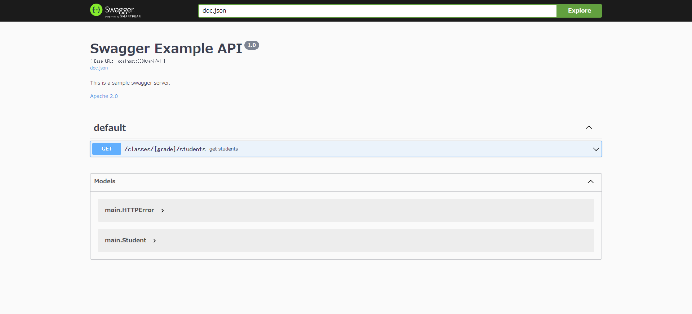
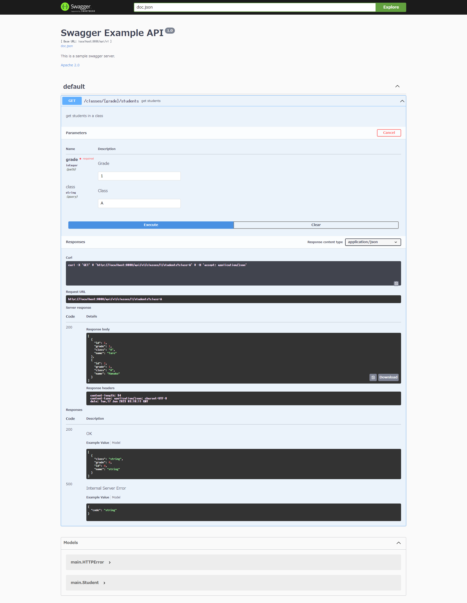
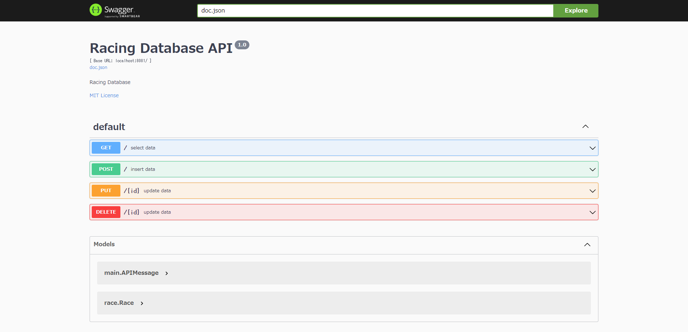

# Lesson 7: API 仕様書を書く

OpenAPI 仕様 (旧 Swagger 仕様)は、REST API を記述するための API フォーマット規格である。
https://swagger.io/docs/specification/about/

OpenAPI 仕様は YAML または JSON 形式で記述する。

```yaml:example.yaml
openapi: '3.0.3'

info:
  title: 'sample APIs'
  version: '0.0.1'

paths:
  '/healthcheck':
    get:
      responses:
        '200':
          description: 'OK'
```

OpenAPI 仕様での記述、可視化のためのツールを使うと、簡便に見やすい API ドキュメントが作成できる。

- [Swagger Editor](https://editor.swagger.io/)
  - OpenAPI 定義を記述用のブラウザベースエディタ
- [Swagger UI](https://swagger.io/tools/swagger-ui/)
  - OpenAPI 定義を見やすく表示するためのツール
- [Swagger Codegen](https://github.com/swagger-api/swagger-codegen)
  - OpenAPI 定義からソースコードを生成するためのツール

YAML や JSON 形式で直接記述する記法はひとまず飛ばして、Go のソースコードにコメント形式で記述する方法から始める。

## Lesson7-1: ソースコードコメントから OpenAPI ドキュメントを自動生成する

まずは、必要なパッケージのインストールをする。

```bash
$ docker-compose up -d
$ docker-compose exec lesson7-1 bash
$ go get -u github.com/swaggo/swag/cmd/swag
```

API 定義が書かれた `main.go` に所定のフォーマットで API ドキュメントを記載する。
記述方法については公式ドキュメントを読む。
https://github.com/swaggo/swag

例えば、以下のように記述する。

```go:main.go
// API General Info
// @title Swagger Example API
// @version 1.0
// @description This is a sample swagger server.
// @license.name Apache 2.0
// @license.url http://www.apache.org/licenses/LICENSE-2.0.html
// @host localhost:8080
// @BasePath /api/v1
func main() {...}

// API Operation
// getStudents is getting students.
// @Summary get students
// @Description get students in a group
// @Accept  json
// @Produce  json
// @Param grade path int true "Grade"
// @Param class query string false "Class" Enum(A, B)
// @Success 200 {array} main.User
// @Failure 500 {object} main.HTTPError
// @Router /classes/{class}/students [get]
func getStudents(c echo.Context) error {...}
```

記述出来たらコマンドを実行して、ローカルにドキュメントを生成する。

```bash
$ swag i
2023/01/14 12:08:47 Generate swagger docs....
2023/01/14 12:08:47 Generate general API Info, search dir:./
2023/01/14 12:08:47 Generating main.User
2023/01/14 12:08:47 Generating main.HTTPError
2023/01/14 12:08:47 create docs.go at  docs/docs.go
2023/01/14 12:08:47 create swagger.json at  docs/swagger.json
2023/01/14 12:08:47 create swagger.yaml at  docs/swagger.yaml
$ ls docs/
docs.go  swagger.json  swagger.yaml
```

記述したコメントをもとに、API ドキュメントが自動生成される。

```yaml
basePath: /api/v1
definitions:
  main.HTTPError:
    properties:
      code:
        type: string
    type: object
  main.Student:
```

これをそのままドキュメントとして公開してもよいが、YAML と JSON 形式なので、読みやすくはない。
[swagger-viewer](https://chrome.google.com/webstore/detail/swagger-viewer/nfmkaonpdmaglhjjlggfhlndofdldfag) などのツールを使えば見やすくはできるが、ユーザー一人一人に導入させるのも親切でない。

そこで、API と一緒にドキュメントもブラウザでそのまま参照できるようにする。

具体的には、Swagger UI の handler を設定する。
echo の場合は、[echo-swagger](https://github.com/swaggo/echo-swagger) というライブラリを使って以下のように記述することができる。

```go
	// swagger
	e.GET("/swagger/*", echoSwagger.WrapHandler)
```

また、生成された docs のパスを import する。
`GOROOT PATH` からの相対パスを記述すればよい。
今回は`GOROOT/app/docs`にあるので、以下のようにする。

```go
import (
	_ "app/docs"
)
```

handler が設定出来たら、実行してみる。

```bash
$ go run main.go
   ____    __
  / __/___/ /  ___
 / _// __/ _ \/ _ \
/___/\__/_//_/\___/ v4.10.0
High performance, minimalist Go web framework
https://echo.labstack.com
____________________________________O/_______
                                    O\
⇨ http server started on [::]:8080
```

API のエンドポイントは以下になっている。

http://localhost:8080/api/v1/classes/1/students

```json
[
  {
    "id": 1,
    "grade": 1,
    "class": "A",
    "name": "Taro"
  },
  {
    "id": 2,
    "grade": 1,
    "class": "A",
    "name": "Hanako"
  },
  {
    "id": 3,
    "grade": 1,
    "class": "B",
    "name": "Jiro"
  },
  {
    "id": 4,
    "grade": 1,
    "class": "B",
    "name": "Yuko"
  }
]
```

API ドキュメントは以下にアクセスすると見やすい形で参照できる。

http://localhost:8080/swagger/index.html



展開すると、`main.go` に記述していれば、リクエストパラメータやレスポンスの期待結果が参照できる。



また、「Try it out」からサンプルリクエストを投げることができる。

ユーザーには、これでリクエスト仕様を理解してもらって、API リクエストを作ってもらうとよいだろう。

> **注意**
> 使用する Go は 1.17 以上にすること。1.16 以下で実行すると失敗する。

```bash
note: module requires Go 1.17
```

[Go の Swagger で Failed to load API definition エラーが発生する \- Qiita](https://qiita.com/Sicut_study/items/ab65655eaaafcf0dd6fa)

API と一緒に公開する代わりに、GitHub Pages で公開したり、GitHub Actions でデプロイの度にドキュメントを更新するようにしてもよいだろう。

その場合は、`docs` の参照先はローカルではなく、リポジトリ上のディレクトリにしておく。

```go
import (
	_ "github.com/Manntera-Studio/go-api-tutorial/lesson7-1/docs"
)
```

### References

- [swag と echo\-swagger を使った Swagger UI での開発談 \- every Engineering Blog](https://tech.every.tv/entry/2022/03/28/170000)
- [Swaggo はじめてみました \- Qiita](https://qiita.com/sgash708/items/6c61faea73acc3dea8b4)
- [\[Golang\]Echo で簡単に Swagger を利用する \- ken\-aio's blog](https://ken-aio.github.io/post/2019/02/05/golang-echo-swagger/)

## Lesson7-2: 複雑な API のドキュメントを書く

Lesson6 で作った API に対しても swag でドキュメントを書くと、こうなる。

コンテナを立ち上げる。

```bash
$ docker-compose up -d
```

ドキュメントの生成はコンテナ立ち上げの中で設定しているので、起動後にページにアクセスすれば見られる。

http://localhost:8081/swagger/index.html



メソッドごとに見やすいカラーリングで見分けられるようになる。

Excel シートにちまちま書いていくより、よっぽど見やすく管理もしやすくなることだろう。
もちろん、内部ロジックなどフリーフォーマットでの記述はしづらいので、そのあたりは従来通り別ドキュメントに書くなど適宜使い分けてほしい。

## Lesson7-3: OpenAPI ドキュメントからソースコードを自動生成する

これまで、ソースコード上に書いたコメントから API ドキュメントを自動生成する方法について学んできたが、実はその逆もできる。

もちろん、テンプレートに基づいて生成されるので、あくまで作られるのは側だけである。
それでも、仕様書を書けば、サンプルコードが作られるというのは、それはそれで魅力的といえよう。

まずは、OpenAPI フォーマットの YAML や JSON を書く必要があるので、そちらの文法について学んでおく。

詳しく書くと膨大な量になってしまうので、下記参考文献を見て学ばれたし。

- [公式ドキュメント](https://swagger.io/specification/)
- [OpenAPI \(Swagger\) まとめ \- Qiita](https://qiita.com/KNR109/items/7e094dba6bcf37ed73cf)
- [OpenAPI と Swagger 入門](https://zenn.dev/chida/articles/25f4016560f6bf)
- [OpenAPI Specification 3\.0 チートシート \- 朝日ネット　技術者ブログ](https://techblog.asahi-net.co.jp/entry/2019/03/04/102734)

大まかには、以下の要素で構成される。

- openapi: 使用する OpenAPI のバージョンを記載する
- info: API のメタデータを記載する
- servers: API を提供しているサーバ情報を記載する
- tags: API を整理するためのタグを記載する
- paths: エンドポイントやリクエストパラメータなど API の仕様を記載する
- components: paths などで共通する定義を使いまわせるよう、コンポーネントとして定義する

1 から上記文法に従って書いてもよいが、ここでは、Lesson7-1 で自動生成された API ドキュメントから逆に Go のソースコードを生成してみる。

生成には [openapi-generator](https://openapi-generator.tech/) を使う。

インストール方法は、`npm` や `brew` などいくつかあるが、環境構築の手間を省くため Docker image を使うことにする。

input ファイル、言語、output ディレクトリを指定して `generate` コマンドを実行する。

```bash
$ docker-compose run --rm lesson7-3-generator generate -i /local/docs/swagger.yaml -g go-server -o /local/app
Creating lesson7_lesson7-3-generator_run ... done
[main] INFO  o.o.codegen.DefaultGenerator - Generating with dryRun=false
[main] INFO  o.o.c.ignore.CodegenIgnoreProcessor - Output directory (/local/app) does not exist, or is inaccessible. No file (.openapi-generator-ignore) will be evaluated.
[main] INFO  o.o.codegen.DefaultGenerator - OpenAPI Generator: go-server (server)
[main] INFO  o.o.codegen.DefaultGenerator - Generator 'go-server' is considered stable.
[main] INFO  o.o.c.languages.AbstractGoCodegen - Environment variable GO_POST_PROCESS_FILE not defined so Go code may not be properly formatted. To define it, try `export GO_POST_PROCESS_FILE="/usr/local/bin/gofmt -w"` (Linux/Mac)
[main] INFO  o.o.c.languages.AbstractGoCodegen - NOTE: To enable file post-processing, 'enablePostProcessFile' must be set to `true` (--enable-post-process-file for CLI).
[main] WARN  o.o.codegen.utils.URLPathUtils - 'scheme' not defined in the spec (2.0). Default to [http] for server URL [http://localhost:8082/api/v1]
[main] WARN  o.o.codegen.utils.URLPathUtils - 'scheme' not defined in the spec (2.0). Default to [http] for server URL [http://localhost:8082/api/v1]
[main] INFO  o.o.codegen.TemplateManager - writing file /local/app/go/model_main_http_error.go
[main] INFO  o.o.codegen.TemplateManager - writing file /local/app/go/model_main_student.go
[main] WARN  o.o.codegen.DefaultCodegen - Empty operationId found for path: get /classes/{grade}/students. Renamed to auto-generated operationId: classesGradeStudentsGet
[main] WARN  o.o.codegen.utils.URLPathUtils - 'scheme' not defined in the spec (2.0). Default to [http] for server URL [http://localhost:8082/api/v1]
[main] INFO  o.o.codegen.TemplateManager - writing file /local/app/go/api_default.go
[main] INFO  o.o.codegen.TemplateManager - writing file /local/app/go/api_default_service.go
[main] WARN  o.o.codegen.utils.URLPathUtils - 'scheme' not defined in the spec (2.0). Default to [http] for server URL [http://localhost:8082/api/v1]
[main] INFO  o.o.codegen.TemplateManager - writing file /local/app/main.go
[main] INFO  o.o.codegen.TemplateManager - writing file /local/app/Dockerfile
[main] INFO  o.o.codegen.TemplateManager - writing file /local/app/go.mod
[main] INFO  o.o.codegen.TemplateManager - writing file /local/app/api/openapi.yaml
[main] INFO  o.o.codegen.TemplateManager - writing file /local/app/go/routers.go
[main] INFO  o.o.codegen.TemplateManager - writing file /local/app/go/logger.go
[main] INFO  o.o.codegen.TemplateManager - writing file /local/app/go/impl.go
[main] INFO  o.o.codegen.TemplateManager - writing file /local/app/go/helpers.go
[main] INFO  o.o.codegen.TemplateManager - writing file /local/app/go/api.go
[main] INFO  o.o.codegen.TemplateManager - writing file /local/app/go/error.go
[main] INFO  o.o.codegen.TemplateManager - writing file /local/app/README.md
[main] INFO  o.o.codegen.TemplateManager - writing file /local/app/.openapi-generator-ignore
[main] INFO  o.o.codegen.TemplateManager - writing file /local/app/.openapi-generator/VERSION
[main] INFO  o.o.codegen.TemplateManager - writing file /local/app/.openapi-generator/FILES
################################################################################
# Thanks for using OpenAPI Generator.                                          #
# Please consider donation to help us maintain this project 🙏                 #
# https://opencollective.com/openapi_generator/donate                          #
################################################################################
```

無事成功すると、output ディレクトリに以下のようにファイル群が生成されている。

```bash
$ tree lesson7-3/app/
lesson7-3/out/go/
├── Dockerfile
├── README.md
├── api
│   └── openapi.yaml
├── go
│   ├── api.go
│   ├── api_default.go
│   ├── api_default_service.go
│   ├── error.go
│   ├── helpers.go
│   ├── impl.go
│   ├── logger.go
│   ├── model_main_http_error.go
│   ├── model_main_student.go
│   └── routers.go
├── go.mod
└── main.go

2 directories, 15 files
```

あとは、生成されたコードを実行すればサーバーが立ち上がる。

```
$ docker-compose up -d
$ docker-compose exec lesson7-3-app bash
$ go mod tidy
$ go run main.go
```

ということを期待するのだが、自動生成だけだと不十分な点があるので、少し手を加える。

まずは、`main.go` のポート番号を直す。

```diff
        router := openapi.NewRouter(DefaultApiController)

-       log.Fatal(http.ListenAndServe(":8080", router))
+       log.Fatal(http.ListenAndServe(":8082", router))
 }
```

続いて、`go/api_default.go` で不要な import があるので削除する。

```diff
 import (
-       "encoding/json"
        "net/http"
        "strings"
```

最後に `go/api_default_service.go` にレスポンス結果を生成するロジックを実装する。

生成直後だと `"ClassesGradeStudentsGet method not implemented"` を返すようにとなっている。
`//TODO` とコメントされている通り、中身はないので自分で作るように書かれている。

Lesson7-1 の `getStudents` と同等の内容を実装してやればよい。

```diff
 import (
        "context"
-       "net/http"
-       "errors"
 )

 // DefaultApiService is a service that implements the logic for the DefaultApiServicer
@@ -32,10 +30,19 @@
        // Add api_default_service.go to the .openapi-generator-ignore to avoid overwriting this service implementation when updating open api generation.

        //TODO: Uncomment the next line to return response Response(200, []MainStudent{}) or use other options such as http.Ok ...
-       //return Response(200, []MainStudent{}), nil
+       students := []*MainStudent{}
+       if class == "" || class == "A" {
+               students = append(students, &MainStudent{Id: 1, Grade: grade, Class: "A", Name: "Taro"})
+               students = append(students, &MainStudent{Id: 2, Grade: grade, Class: "A", Name: "Hanako"})
+       }
+       if class == "" || class == "B" {
+               students = append(students, &MainStudent{Id: 3, Grade: grade, Class: "B", Name: "Jiro"})
+               students = append(students, &MainStudent{Id: 4, Grade: grade, Class: "B", Name: "Yuko"})
+       }
+       return Response(200, students), nil

        //TODO: Uncomment the next line to return response Response(500, MainHttpError{}) or use other options such as http.Ok ...
        //return Response(500, MainHttpError{}), nil

-       return Response(http.StatusNotImplemented, nil), errors.New("ClassesGradeStudentsGet method not implemented")
+       // return Response(http.StatusNotImplemented, nil), errors.New("ClassesGradeStudentsGet method not implemented")
 }
```

ここまで直したうえで、サーバーを立ち上げてアクセスすると、Lesson7-1 と同様の内容が返却される。

```bash
$ go run main.go
2023/01/18 16:21:06 Server started
2023/01/18 16:21:09 GET /api/v1/classes/1/students ClassesGradeStudentsGet 42.689µs
```

http://localhost:8082/api/v1/classes/1/students

```json
[
  {
    "class": "A",
    "grade": 1,
    "id": 1,
    "name": "Taro"
  },
  {
    "class": "A",
    "grade": 1,
    "id": 2,
    "name": "Hanako"
  },
  {
    "class": "B",
    "grade": 1,
    "id": 3,
    "name": "Jiro"
  },
  {
    "class": "B",
    "grade": 1,
    "id": 4,
    "name": "Yuko"
  }
]
```

自動生成されるコードの作りは

1. `go/api_default_server.go` の `DefaultApiService` で service 構造体を作る
1. `go/api_default.go` の `DefaultApiController` で service から controller を作る
1. controller から `go/api_default.go` および `go/routers.go` で router を作る
1. router を `main.go` の `http.ListenAndServe` に渡してサーバーを起動する

となっている。
なので、`go/api_default_server.go` 以下で返却するデータ生成や取得を行うロジックを書けばよい。

なお、自動生成されたコードには swag 形式でのコメントはされていない。
そのため、別のツールを使ってドキュメント生成をするか、自動生成されたコードに自分でコメントを追加する必要がある。
少なくとも、openapi-generator と swaggo の行き来はできない。

使うのであれば、openapi-generator でテンプレートを作り、その後は、コード改修と一緒にコメントを記述して API ドキュメントをアップデートするという方式が良さそうに見える。

### References

- [OpenAPI Generator で Go の API サーバー/クライアントコードを自動生成する \- Qiita](https://qiita.com/saki-engineering/items/b20d8b6074c4da9664a5)
- [OpenAPI3 を使ってみよう！Go 言語でクライアントとスタブの自動生成まで！ \- ZOZO TECH BLOG](https://techblog.zozo.com/entry/openapi3/go?amp=1)
